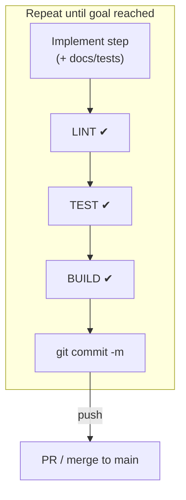
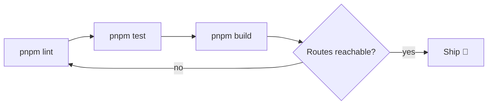

# AGENTS.md — Run‑Book for the **Codex** Agent

> **Audience** Autonomous / semi‑autonomous agents (e.g. ChatGPT Codex) hacking on this repo.
> **Goal** Keep CI green, respect project conventions, ship improvements quickly.

---

## 1 Environment

| Key            | Value                            |
| -------------- | -------------------------------- |
| Node.js        | **20.x** (LTS)                   |
| Package mgr    | **pnpm** (lockfile committed)    |
| Runtime dir    | `/workspace/portfolio`           |
| Default branch | `main`                           |
| Test runner    | Node built‑in **`node:test`**    |
| Lint           | `pnpm lint` → Next ESLint preset |
| Build          | `pnpm build`                     |
| Dev            | `pnpm dev`                       |

The container has full network access & Linux shell.
Use bash commands freely (`ls`, `grep`, `pnpm build`, …).

---

## 2 Repository Map — High Level

```text
src/
  app/              ← Next 15 app‑router pages
    blog/
    work/
    books/          ← (created by agent)
    music/          ← (created by agent)
  components/       ← Once‑UI React components & helpers
  resources/
    content.js      ← 🏠 Central profile + copy
    once-ui.config.js
    icons.ts        ← Icon registry (react-icons)
public/              ← Static assets
```

> Tip `grep -R "foo" src/` to locate code fast.

---

## 3 Golden Rules

1. **Main must stay green**
   Run the *trifecta* before merging into `main`.

   ```bash
   pnpm lint && pnpm test && pnpm build
   ```

2. **Small commits** Logical, reversible, CI‑passing.
   Commit‑msg style → `type(scope): subject` (e.g. `feat(books): add The Liminal card`).

3. **Runtime deps** require justification in the PR.
   Dev‑deps fine if tests / tooling need them.

4. Respect **ESLint / Prettier** — run `pnpm lint --fix` after large edits.

5. **TypeScript strict** (`noImplicitAny`).
   `any` / `@ts-expect-error` allowed only inside `tests/**`.

6. **Hands off** auth & licensing logic unless explicitly instructed.

---

## 4 Workflow for Multi‑Step Objectives



*Use the sentinel `echo "DONE_STEP_<n>"` in the console if an orchestrator
needs it; the string isn’t required inside commits.*

---

## 5 Command Cheat‑Sheet

```bash
pnpm install         # after any package.json change
pnpm lint            # ESLint
pnpm test            # node:test suite
pnpm build           # prod build (Next.js)
git add -A && git commit -m "msg"
git push origin <branch>
```

`pnpm test` transpiles TS with
`tsc -p tsconfig.test.json` → then runs `node --test dist-test`.

---

## 6 Common Pitfalls & Fixes

| Problem                                        | Fix / Hint                                                                  |
| ---------------------------------------------- | --------------------------------------------------------------------------- |
| **ESLint** `next/core-web-vitals`              | Ensure `eslint-config-next` dev‑dep exists, run `pnpm lint` from repo root. |
| 404 in `next/og` images / fonts                | Use absolute URLs (`src={baseURL + path}`).                                 |
| MDX front‑matter keys missing                  | Run tests; add `title`, `publishedAt`, etc.                                 |
| Default‑import trouble in tests                | Use `--esModuleInterop` or `import * as fs from "fs"`.                      |
| Missing **default export** in `components/**`  | Match filename → default export; add to barrel; run smoke tests.            |
| Barrel **out‑of‑sync** (`components/index.ts`) | Re‑export new component, or delete stale entry; `pnpm test` will fail fast. |

---

## 7 Style Guidelines

* **React / JSX** Functional components, hooks; no classes.
* **Once‑UI** Prefer high‑level primitives (`Column`, `Flex`, `Grid`).
* **Images** Next `<Image />` except in `next/og` routes.
* **Imports** Absolute (`@/components/…`) via `tsconfig.paths`.
* OG image routes live at `<page>/og/route.tsx` with `next/og`’s `ImageResponse`.

---

## 8 Merge Checklist



* [ ] **Lint** clean
* [ ] **Tests** green
* [ ] **Build** succeeds (no static‑GP errors)
* [ ] New pages reachable at intended routes
* [ ] Commits pushed / PR merged

---

## 9 Lessons Learned — 22 → 28 June 2025 Retrospective

1. **Fail‑Fast Branches** Run risky experiments in throw‑away branches. If CI fails twice consecutively, stop auto‑committing and open a retrospective before continuing.
2. **Component Export Consistency** Every component file must export **one** default whose name matches the filename (PascalCase). Supplement with named exports only when truly needed.
3. **Barrel Hygiene Test** Add a smoke test that `import "@/components"` and verifies every export renders without throwing. Catches missing re‑exports early.
4. **Smoke‑Test All Routes** Add an integration test that does `Promise.all` over every page in `src/app/` and checks the default export is defined, preventing missing files like the vanished `Date.tsx`.
5. **Dependency Discipline** Pin dependency versions; upgrade only with a clear ticket. Unplanned bumps (e.g. `@once-ui-system/core`) caused hidden breaking changes.
6. **Tag Known‑Good Releases** Use `git tag v0.9-working b358e99 && git push origin v0.9-working` so rollbacks reference human‑readable points instead of hashes.
7. **Force‑Push Safeguard** Create a global alias `git config --global alias.pushfl 'push --force-with-lease'`—never plain `--force`.
8. **Agent Timebox** Autonomous agents get a budget of **≤ 5 commits or ≤ 30 min** before mandatory human review to prevent log spam and direction drift.
9. **Docs‑First Coding** Update `AGENTS.md` (and inline code comments) *before* writing code when introducing new conventions; future agents then start with the right map.

---

# Happy shipping! 🚀
