# jakelawrence.io – Infrastructure & Deployment Playbook
One stop for everything from DNS → NGINX → Let’s Encrypt → Webhook → PM2 → Next.js build, plus CI/CD & common fixes.  
_Last updated · **2025-06-23 19 : 55 UTC**_

---

## 1 Domain & DNS

```mermaid
%% DNS records → droplet + NS delegation
flowchart LR
  A[DNS records<br/>@ Namecheap]
  B[DigitalOcean droplet<br/>198.199.84.78]

  A -->|A & AAAA| B

  subgraph DigitalOceanNS
    direction LR
    ns1[ns1]
    ns2[ns2]
    ns3[ns3]
  end
  A -. NS .- DigitalOceanNS
````

| Record | Host      | Type | Value                           | TTL  |
| ------ | --------- | ---- | ------------------------------- | ---- |
| A      | `@`       |      | 198.199.84.78                   | 3600 |
| A      | `www`     |      | 198.199.84.78                   | 3600 |
| AAAA   | `@`,`www` |      | 2604\:a880:400\:d1::2:3485:9001 | 3600 |
| NS     | `@`       |      | ns1 – ns3.digitalocean.com      | 1800 |

> **Goal —** apex + `www` on the droplet; IPv6 kept.
> Cloudflare can be layered in front later.

---

## 2 Droplet baseline

* **Size:** Ubuntu 24.10 (Jammy) · 4 GB RAM · 2 vCPU · 50 GB SSD
* **Access:** `root` via SSH key only; unattended-upgrades *on*

```bash
apt update && apt upgrade -y
apt install nginx certbot python3-certbot-nginx git \
           curl ufw dos2unix build-essential -y
```

---

## 3 Firewall (UFW)

```bash
ufw default deny incoming
ufw default allow outgoing
ufw allow 22/tcp          # SSH
ufw allow 80,443/tcp      # HTTP + HTTPS
ufw enable
ufw status verbose
```

---

## 4 TLS (Let’s Encrypt)

```bash
certbot --nginx -d jakelawrence.io -d www.jakelawrence.io \
        --email you@example.com --agree-tos --redirect
```


Renewal is handled by the `certbot.timer` unit shipped with the snap.

---

## 5 NGINX reverse-proxy

`/etc/nginx/sites-available/jakelawrence.io` → symlink to `sites-enabled/`.

```nginx
# 1) www → apex (HTTP)  ······················································
server {
    listen 80;
    listen [::]:80;
    server_name www.jakelawrence.io;
    return 301 https://jakelawrence.io$request_uri;
}

# 2) www → apex (HTTPS)
server {
    listen 443 ssl;
    listen [::]:443 ssl;
    server_name www.jakelawrence.io;
    ssl_certificate     /etc/letsencrypt/live/jakelawrence.io/fullchain.pem;
    ssl_certificate_key /etc/letsencrypt/live/jakelawrence.io/privkey.pem;
    return 301 https://jakelawrence.io$request_uri;
}

# 3) Apex HTTP → HTTPS
server {
    listen 80;
    listen [::]:80;
    server_name jakelawrence.io;
    return 301 https://$host$request_uri;
}

# 4) Main HTTPS server  ······················································
server {
    listen 443 ssl;
    listen [::]:443 ssl;
    server_name jakelawrence.io;

    ssl_certificate     /etc/letsencrypt/live/jakelawrence.io/fullchain.pem;
    ssl_certificate_key /etc/letsencrypt/live/jakelawrence.io/privkey.pem;

    # GitHub → /deploy → webhook (9001)
    location = /deploy {
        limit_req zone=deploy_zone burst=2 nodelay;
        proxy_pass http://127.0.0.1:9001/hooks/deploy-jake$is_args$args;
        proxy_set_header Host            $host;
        proxy_set_header X-Real-IP       $remote_addr;
        proxy_set_header X-Forwarded-For $proxy_add_x_forwarded_for;
    }

    # Next.js app via PM2
    location / {
        proxy_pass http://127.0.0.1:3000;
        proxy_http_version 1.1;
        proxy_set_header Upgrade    $http_upgrade;
        proxy_set_header Connection "upgrade";
        proxy_set_header Host       $host;
        proxy_cache_bypass          $http_upgrade;
    }
}

# 1 req/sec flood-guard for webhook
limit_req_zone $binary_remote_addr zone=deploy_zone:10m rate=1r/s;
```

```bash
ln -s /etc/nginx/sites-available/jakelawrence.io /etc/nginx/sites-enabled/
nginx -t && systemctl reload nginx
```

---

## 6 Webhook service

* **`/etc/webhook/hooks.json`**
* **`/etc/systemd/system/webhook.service`**

(see repository for full JSON / unit file)

---

## 7 Webhook & deploy script

```mermaid
%% push→curl→webhook→shell→PM2
flowchart LR
  GH[GitHub<br/>push→main] --> WH[Webhook<br/>:9001/deploy]
  WH --> SH[/opt/deploy/portfolio.sh/]
  SH --> PM2[PM2 process]
  PM2 --> APP[Next.js<br/>:3000]
```



`/opt/deploy/portfolio.sh`

```bash
#!/usr/bin/env bash
set -euxo pipefail

REPO=/var/www/jakelawrence.io
PNPM=/usr/local/bin/pnpm

echo "🚀  Deploy started $(date -u)"

git -C "$REPO" fetch --all
git -C "$REPO" reset --hard origin/main
git -C "$REPO" clean -fd -e .next

cd "$REPO"
$PNPM install --silent
$PNPM run build

if pm2 describe portfolio >/dev/null 2>&1; then
  pm2 reload portfolio --update-env
else
  pm2 start "$PNPM" --name portfolio --cwd "$REPO" -- start
fi
pm2 save

echo "✅  Deploy finished $(date -u)"
```

---

## 8 PM2 baseline

```bash
npm install -g pm2
pm2 start "/usr/local/bin/pnpm" --name portfolio \
         --cwd /var/www/jakelawrence.io -- start
pm2 save
pm2 startup systemd -u root --hp /root
```

`pm2-logrotate` is auto-installed and enabled.

---

## 9 CI / CD pipeline (GitHub Actions)

```mermaid
%% CI → Deploy overview
flowchart TD
  A[Push<br/>main] --> B[CI job<br/>lint·test·build]
  B -->|✓| C[Deploy job<br/>SSH → deploy script]
  C --> D[/opt/deploy/portfolio.sh/]
  D --> PM2[PM2 process]
  PM2 --> APP[Next.js<br/>:3000]
```



* **CI job** – Node 20 + pnpm 10, then `lint`, `test`, `build`.
* **Deploy job** – only runs when CI passes; uses SSH to run the deploy script.

Secrets required: `WEBHOOK_URL`, `WEBHOOK_SECRET`, `DO_SSH_KEY`, `DO_HOST`.

---

## 10 Troubleshooting cheatsheet

| Symptom                            | Likely cause & quick fix                            |
| ---------------------------------- | --------------------------------------------------- |
| `ENOENT … pages-manifest.json`     | `.next/` wiped – exclude with `git clean -e .next`. |
| Webhook logs `pnpm … exit 1` only  | Lockfile mismatch – commit updated lockfile.        |
| Webhook 502 / NGINX upstream error | App crashed – `pm2 logs`, then rebuild.             |
| `permission denied` running script | `chmod 755 /opt/deploy/portfolio.sh`.               |

---

## 11 Changelog

| Date (UTC)     | Note                                                                       |
| -------------- | -------------------------------------------------------------------------- |
| **2025-06-23** | Deploy script moved to `/opt/deploy`, switched to pnpm 10, auto PM2 reload |
| **2025-06-22** | TLS + webhook + Node 20 + PM2 baseline                                     |
| **2025-06-21** | Droplet created, DNS & firewall, first manual build                        |

---

### Manual deploy (optional)

`curl`ing the webhook still works for ad‑hoc redeploys:

```bash
curl -s "https://jakelawrence.io/deploy?secret=SUPERSECRET123"
```

Happy shipping 🚢
