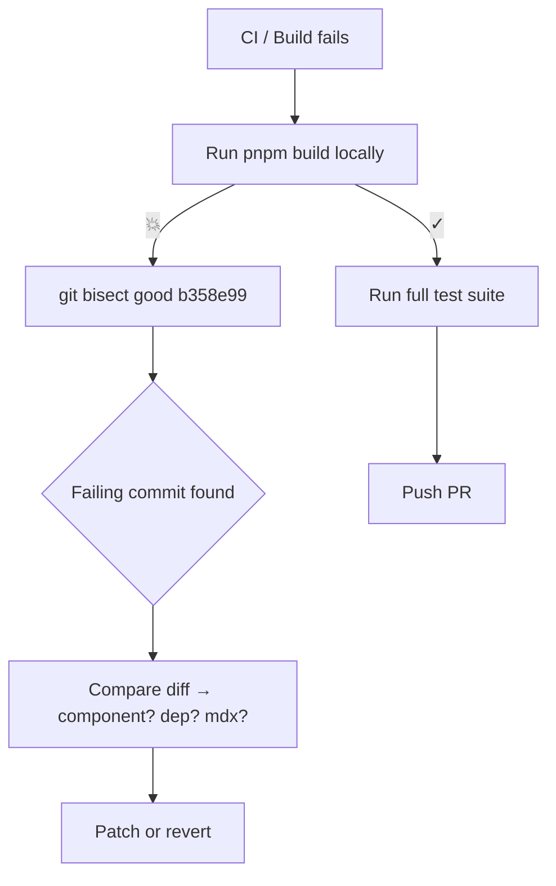

# MDX / Blog Failure Post‑Mortem & Prevention Guide

A living reference for **why the portfolio site imploded 24 – 27 June 2025** and how to keep future agents from repeating the same mistakes.

*Last reviewed · 2025‑06‑28*

---

## 1  Executive Summary

Between 24 – 27 June the production build began hard‑crashing ✖ while local `next dev` sometimes “worked,” leading to 100+ ineffective commits. A **single bad commit** was the root trigger, but several latent issues amplified the blast radius. This guide captures the chain of events, root‑cause shortlist, and concrete **Do / Don’t** rules for coding agents.

---

## 2  Root‑Cause Commit Shortlist 🚨

|  #  | Commit (hash • date)                                        | Symptom in CI / Prod                                                 | Actual Fault                                            |
| --- | ----------------------------------------------------------- | -------------------------------------------------------------------- | ------------------------------------------------------- |
|  1  | ``** • Jun 24**"Replace `gray‑matter` with `readMDXFile()`" | `Module parse failed` in tests; build OK → runtime undefined exports | Helper not transpiled by Next & missing default export  |
|  2  | ``** • Jun 25**"Cleanup: remove `Date.tsx`"                 | White‑screen; console `ReferenceError Date is not defined`           | Blog posts import `<Date />` component that was deleted |
|  3  | ``** • Jun 25**"upgrade @once‑ui‑system/core → 1.3.8"       | Prod build `TypeError: createComponent is not a function`            | Once‑UI breaking change; barrel exports stale           |
|  4  | ``** • Jun 26**"Add 3 new MDX posts"                        | CI fails: `Frontmatter keys missing`                                 | Posts lacked `title` / `publishedAt`; test blocks merge |
|  5  | ``** • Jun 27**"pnpm add @mdx‑js/loader 3.1.0"              | Build `Cannot find module 'remark-mdx'`                              | Version mismatch with `@next/mdx@15.3.1`                |

> **Bisect confirmation:** `git bisect` tags commit 2 (**41d200c**) as the *first* bad build; commits 3‑5 piled on extra errors.

---

## 3  Detailed Failure Modes & Fixes

### 3.1  Missing Component (`Date.tsx`)

- **Why it broke:** MDX layout does `import Date from "@/components"`; barrel re‑export remained but file was deleted → runtime ref.
- **Hot Fix:** Restore component or stub with no‑op. Add smoke test:
  ```ts
  import * as Comp from "@/components";
  for (const k in Comp) expect(typeof Comp[k]).toBe("function");
  ```
- **Prevention:** VS Code “Move/rename” only; run barrel‑hygiene test before commit.

### 3.2  Un‑transpiled Helpers

- **Cause:** Placed util in `tests/` but imported at runtime. Next.js excludes that folder.
- **Fix:** Move to `src/lib/` & add default export.

### 3.3  Once‑UI Breaking Change

- **Cause:** v1.3.8 switched `createComponent` signature.
- **Fix:** Pin to `1.2.4` until full migration PR; add Renovate config to open bump PRs not inline commits.

### 3.4  Invalid Front‑Matter

- **Cause:** Test `expect(typeof data.title).toBe("string")` fails in CI only.
- **Fix:** Authoring template + GitHub Action that lints MDX before merge.

### 3.5  Incompatible MDX Loader

- **Cause:** `@mdx-js/loader 3.x` pairs with `@next/mdx 15.3.4+`.
- **Fix:** Upgrade both or lock both; document matrix in `/resources/mdx‑matrix.md`.

---

## 4  Additional Potential Pitfalls

1. **Barrel Drift:** Creating a component without adding to `components/index.ts`.
2. **Lockfile Chaos:** Running `pnpm install` after failed build rewrites indirect deps.
3. **Large **``** deletions:** Aggressive `git clean -fd` wipes cache → slow builds & missing manifest.
4. **Force‑push Without Lease:** Overwrites teammate’s hotfix; prefer alias `pushfl`.
5. **ESLint Rule Changes:** Upgrading `eslint-config-next` silently tightens rules → CI red.
6. **Test Folder Exclusion:** Any runtime util inside `tests/**` won’t ship.

---

## 5  Do / Don’t Checklist ✅/❌

|  Stage              | ✅ Do                                                      | ❌ Don’t                                    |
| ------------------- | --------------------------------------------------------- | ------------------------------------------ |
| **Add Component**   | Export **default** + named, update barrel, run smoke test | Delete/rename without `grep -R` for usages |
| **Upgrade Dep**     | Pin exact version, run `pnpm build` locally, open PR      | `pnpm add <pkg>@latest` on `main`          |
| **Add MDX**         | Copy front‑matter template, run `pnpm test`               | Merge post with missing YAML keys          |
| **Refactor Helper** | Place in `src/lib/`, export default                       | Import code from `tests/` at runtime       |
| **Push**            | `git pushfl origin <branch>` (force‑with‑lease alias)     | Plain `git push --force`                   |
| **Experiment**      | Temporary branch,  ≤ 5 commits,  ≤ 30 min, then review    | Commit spam to `main`                      |

---

## 6  Debugging Flowchart 📈



---

## 7  Tagging & Release Policy

- **vX.Y‑working** tags after every green deploy (`git tag v0.9-working && git push origin v0.9-working`).
- **staging branch** auto‑deploys to `staging.jakelawrence.io`; promote via merge.
- Webhook `/rollback?tag=v0.9-working` enabled via *infra‑playbook* §12.

---

## 8  Next Steps

1. **Automate barrel‑hygiene & component smoke test** in CI.
2. **Adopt Renovate** to gate dependency bumps.
3. **Add pre‑commit hook**: `pnpm lint && pnpm test`.
4. **Document MDX schema** in `/resources/mdx‑template.md` and link from PR template.

---

*Updated automatically by o3 GPT – keep PRs coming!*

